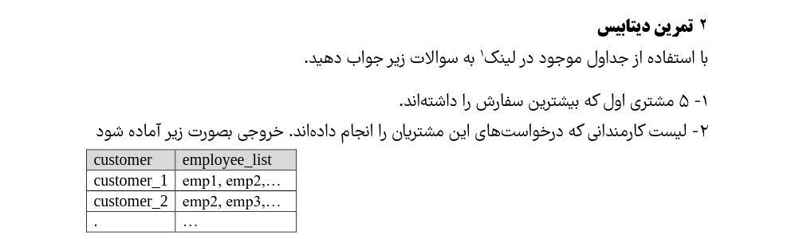
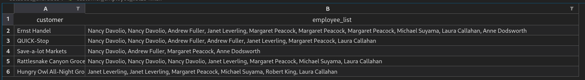

# Database Exercise


## Overview

This exercise involves querying a database to answer specific questions based on existing tables. The goal is to extract meaningful information regarding customers and their requests.

## Tables
- **Customers**: Contains information about customers.
- **Requests**: Contains details about requests made by customers.


## Instructions
1. **Identify the Customer**:
   - Write a SQL query to find the customer who has made the most requests.
   - Ensure to count the number of requests associated with each customer.

2. **Retrieve Requests**:
   - Once the customer is identified, write another SQL query to fetch all requests made by this customer.
   - Format the output in a clear and organized manner.

## Example SQL Queries

### Step 1: Identify the Customer with the Most Requests
```sql
SELECT TOP 5 Customers.CustomerID, Customers.CustomerName, SUM(OrderDetails.Quantity) AS TotalQuantity
FROM Customers, Orders, OrderDetails
WHERE Customers.CustomerID = Orders.CustomerID
AND Orders.OrderID = OrderDetails.OrderID
GROUP BY Customers.CustomerID, Customers.CustomerName
ORDER BY SUM(OrderDetails.Quantity) DESC;
```


## Output Format
- The output should be presented in a structured format, showing all relevant details of the requests made by the identified customer.

## Conclusion
By following the above steps, you will be able to extract the necessary information from the database regarding the customer with the highest number of requests and their corresponding details.


```
SELECT Customers.CustomerID, 
       Customers.CustomerName, 
       Employees.EmployeeID, 
       Employees.LastName, 
       Employees.FirstName
FROM (Customers
      INNER JOIN Orders ON Customers.CustomerID = Orders.CustomerID)
      INNER JOIN Employees ON Orders.EmployeeID = Employees.EmployeeID
WHERE Customers.CustomerID = 20;

```


