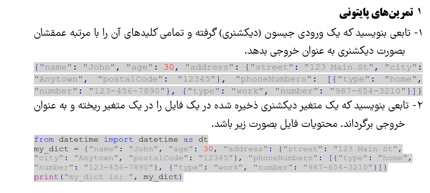

# Python Exercises
This repository contains solutions to various Python exercises.

Base one the question below:


## Folded Structur

```
├── init.py
├── python_exercise.png
├── README.md
├── requirements.txt
├── tasks
│   ├── dictionary_depth.py
│   ├── init.py
│   └── load_dictionary.py
├── tests
│   ├── init.py
│   └── test_dictionary_depth.py
└── utils
├── init.py
├── utils.json
└── utils.py
```


---
# My Python Tasks

This repository contains solutions for two Python tasks involving dictionary manipulation. Each task has its own Python module for separation and ease of testing. 

## Table of Contents
1. [Task 1: Sort Dictionary Keys Alphabetically](#task-1-sort-dictionary-keys-alphabetically)
2. [Task 2: Save and Load Dictionary from a File](#task-2-save-and-load-dictionary-from-a-file)
<!-- 3. [Project Structure](#project-structure) -->
4. [How to Run Task1](#how-to-run-task1)
4. [How to Run Task2](#how-to-run-task2)

---

## Task 1: Sort Dictionary Keys Alphabetically

### Description
This task requires a function that:
1. Takes a dictionary (or JSON input).
2. Sorts all its keys alphabetically.
3. Returns the sorted dictionary.

The sorting applies recursively to nested dictionaries, so all levels of the dictionary will be sorted by their keys in alphabetical order.

### Code Reference
- Module: `tasks/sort_dictionary.py`
- Key Function: `sort_dictionary(input_dict: dict) -> dict`
- Python Modules Used:
  - `json`: Used to parse JSON strings if needed, though this task primarily manipulates Python dictionaries directly.

### Example Usage
```python
from tasks.sort_dictionary import sort_dictionary

input_dict = {
    "name": "John",
    "age": 30,
    "address": {
        "street": "123 Main St",
        "city": "Anytown",
        "postalCode": "12345"
    },
    "phoneNumbers": [
        {"type": "home", "number": "123-456-7890"},
        {"type": "work", "number": "987-654-3210"}
    ]
}

sorted_dict = sort_dictionary(input_dict)
print(sorted_dict)
```
## How to Run Task1
Here's a sample `README.md` file that provides instructions on how to run the `dictionary_depth.py` script and how to run the tests. You can customize it further based on your specific project needs.


# Dictionary Depth Project

This project contains a Python module for extracting keys from a dictionary along with their respective depths. It also includes a set of unit tests to ensure the functionality of the module.

## Table of Contents

- [Installation](#installation)
- [Usage](#usage)
- [Running Tests](#running-tests)

## Installation

1. Clone the repository:
   ```bash
   git clone https://github.com/yourusername/behsazan-tasks.git
   cd behsazan-tasks/python_exercises
   ```

2. Install the required packages:
   ```bash
   pip install -r requirements.txt
   ```

## Usage

To run the `dictionary_depth.py` script, you can use the following command in your terminal:

```bash
python tasks/dictionary_depth.py
```

Make sure to modify the script to include any specific input or functionality you want to test.

## Running Tests

To run the unit tests for the `dictionary_depth.py` module, you can use the `unittest` framework. Run the following command in your terminal:

```bash
python -m unittest discover -s tests
```

This command will discover and run all the test cases defined in the `tests` directory.

### Test Output

The test results will be displayed in the terminal, indicating which tests passed and which failed. You can also customize the logging output in the test files to provide more detailed information about the test execution.


---

## Task 2: Save and Load Dictionary from a File


```bash
python tasks/load_dictionary.py
```

